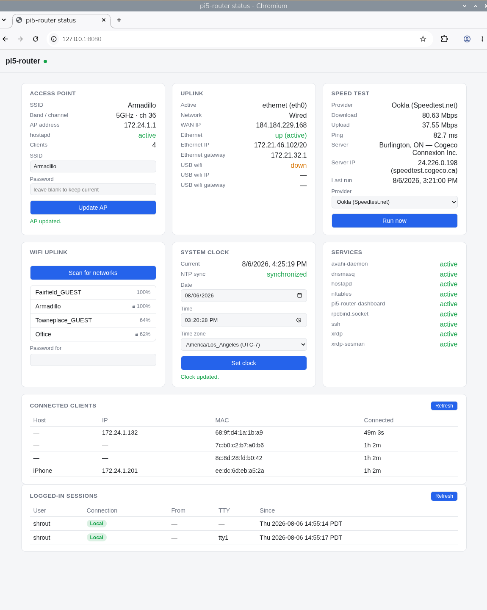

# pi5-router

This turns a
Raspberry Pi 5 into your own personal travel router: plug it into whatever
the hotel gives you (ethernet, or their wifi if that's all there is), and it
puts out a clean, password-protected network just for your own stuff,
with a little dashboard so you can see what's going on.

Under the hood, that means:

- Uplink to the hotel network via wired Ethernet when available, falling back
  automatically to a USB wifi adapter (tested with the Alfa AWUS036AXML) when
  it's not. NetworkManager's route metrics handle the failover — Ethernet
  just needs a lower metric than the wifi uplink, which is the NetworkManager
  default.
- NATed access point on the Pi's onboard wifi radio for devices in the room.
- SSH and RDP (xrdp) reachable only from the AP-side subnet, never from the
  hotel-facing interfaces.
- Status dashboard (connected clients, uplink/AP/service status, WAN IP,
  speed test) at `http://172.24.1.1:8080` or `http://127.0.0.1:8080` —
  same AP-subnet-and-loopback-only restriction as SSH/RDP.
- Silent on the hotel-facing side: no response to port scans or pings, no
  mDNS/Bonjour broadcasts, no RPC portmapper exposure.

Built for Debian 13 (trixie) on a Raspberry Pi 5, using NetworkManager +
nftables. Requires:
- one wired Ethernet interface (NetworkManager-managed)
- one onboard wifi radio (becomes the AP)
- one USB wifi adapter (becomes the wifi uplink)

## Usage

```sh
cp router.conf.example router.conf
$EDITOR router.conf        # set your SSID/passphrase, subnet, DNS, etc.
sudo ./install.sh
```

Re-running `install.sh` is safe — it's idempotent, and only changes files it
owns or a small set of well-known package-config lines it edits in place
(each of those gets a one-time `*.pi5-router.orig` backup on first touch).

`router.conf` is gitignored since it holds the wifi passphrase — copy it from
`router.conf.example` locally rather than committing real credentials.

## Dashboard

A small Flask app gives you a one-page view of everything the router's
doing: AP status with an SSID/password update form, uplink details
(per-interface IPs, gateway, WAN IP), a multi-provider speed test (Ookla,
Cloudflare, LibreSpeed, fast.com), a wifi network picker for the uplink, the
system clock (with a manual set for the no-RTC gotcha below), connected
clients, service health, and logged-in sessions. Same trust boundary as
SSH/RDP — only reachable from the AP subnet or loopback, never from the
hotel side.



## After running

The Pi's own uplink still has to clear the hotel's captive portal itself
before the room network gets real internet access — a device connected to
the AP can't do this on the Pi's behalf, since most hotel portals gate
per-MAC/per-session on the uplink connection, not on downstream NATed
clients. RDP into the AP address (`${AP_IP}:${RDP_PORT}` from your
`router.conf`) for a full XFCE desktop to pick the uplink SSID (via the
NetworkManager applet in the panel) and drive the portal login in Firefox
or Chromium, both installed.

## Known gotchas

- **Clock / RTC.** This hardware has no RTC battery, so the clock resets
  to 1970 on power loss and stays wrong until NTP syncs — which needs the
  uplink already online, a chicken-and-egg problem a captive portal makes
  worse. A wrong clock breaks OCSP/certificate validation on nearly every
  HTTPS site, including the portal's own login page, and presents as an
  unrelated-looking "secure connection failed" error rather than an
  obvious clock warning. If this happens, set the date manually before
  troubleshooting anything else HTTPS-related:
  `sudo date -s "YYYY-MM-DD HH:MM:SS"` (local time).
- **Firefox DNS-over-HTTPS.** Disabled system-wide by this installer
  (`templates/firefox-policies.json.tmpl`) because it bypasses the local
  resolver and silently breaks captive-portal redirect detection — the
  symptom is "nothing loads," not an obvious DNS error. Chromium has no
  equivalent policy deployed here; if it also fails to detect the portal,
  check `chrome://settings/security` → "Use secure DNS".
- **RDP shows a black screen / desktop looks alive but renders nothing.**
  XFCE's GTK3 apps prefer a Wayland backend and will silently connect to
  a local monitor's Wayland compositor instead of the RDP X11 session
  whenever one is active on the same box, rather than erroring. `.xsession`
  (`templates/xsession.tmpl`) forces `GDK_BACKEND=x11` specifically to
  prevent this — if you ever recreate `~/.xsession` by hand, keep that
  line.

## Verification checklist

1. `nft list ruleset` — ruleset matches `templates/nftables.conf.tmpl`,
   `nftables.service` enabled.
2. From a device connected to the AP SSID: gets a lease in the configured
   DHCP range, can reach `ssh`/RDP on the AP IP, has internet once the
   uplink is past the captive portal, and can load the status dashboard at
   `http://172.24.1.1:8080` (shows itself in the connected-clients list).
3. From the hotel-side network: `nmap -Pn <pi-hotel-ip>` shows nothing open
   (including the dashboard port), `ping` gets no reply, `avahi-browse -a`
   from another device on that segment doesn't see the Pi.
4. `ip addr show`, `ip route` — no IPv6 global addresses on the uplink
   interfaces; default route flips between Ethernet and wifi automatically
   as you plug/unplug Ethernet.
5. SSH/RDP connection attempts from the hotel-side network fail
   (refused/timeout); attempts from the AP subnet succeed.
6. `sudo ./install.sh` a second time completes cleanly with no duplicated
   NetworkManager connections or firewall rules.

## Changing SSID/subnet for a different trip

Just edit `router.conf` and re-run `sudo ./install.sh` — nothing else to
touch.
